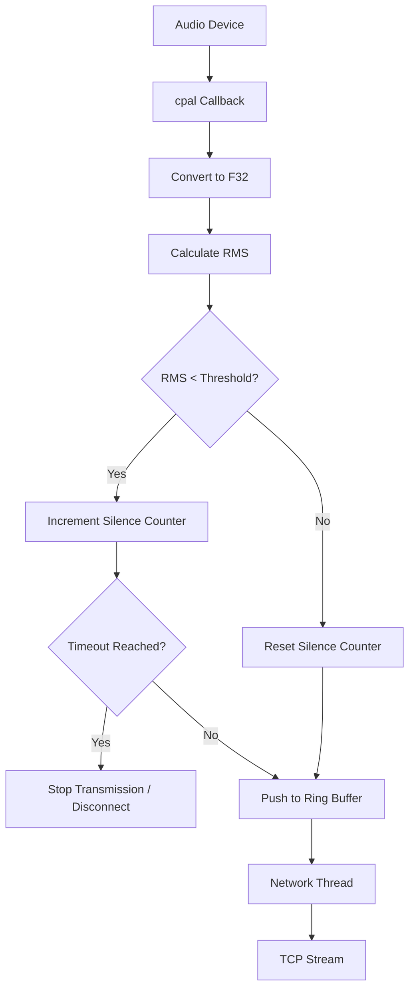

## Overview

TCP Streamer includes an intelligent silence detection system that monitors audio levels in real-time and can automatically stop transmission during quiet periods. This feature significantly reduces network bandwidth usage and prevents streaming of background noise or silent audio.

<Note>
**Current Status (v1.8+):** While the silence detection infrastructure exists in the codebase, the feature was simplified in v1.8.0 during the F32 architecture refactor. The RMS calculation and visual volume meter remain active for monitoring, but automatic transmission gating based on silence is not currently active in the latest release.

This documentation describes the **design and implementation** of the silence detection system for future reference and potential re-enablement.
</Note>

## How It Works

### RMS (Root Mean Square) Calculation

The system calculates the RMS (Root Mean Square) value of incoming audio to determine volume level. RMS is a standard measure of audio power that accounts for both positive and negative waveform values.

<Steps>
  <Step title="Calculate Square of Samples">
    For each audio sample in the buffer:
    ```rust
    let sample_f32 = sample as f32 / 32768.0; // Normalize I16 to F32
    sum_of_squares += sample_f32 * sample_f32;
    ```
  </Step>
  
  <Step title="Compute Mean">
    Divide by the number of samples:
    ```rust
    let mean = sum_of_squares / sample_count as f32;
    ```
  </Step>
  
  <Step title="Take Square Root">
    Calculate the RMS value:
    ```rust
    let rms = mean.sqrt();
    ```
  </Step>
  
  <Step title="Compare to Threshold">
    Check if RMS is below the configured threshold:
    ```rust
    if rms < silence_threshold {
        // Audio is considered silent
    }
    ```
  </Step>
</Steps>

### RMS Scale and Typical Values

RMS values range from **0.0** (complete silence) to **1.0** (maximum volume):

| RMS Value | Volume Level | Description |
|-----------|--------------|-------------|
| 0.0 - 0.01 | Silent | Background noise floor |
| 0.01 - 0.05 | Very Quiet | Ambient room noise |
| 0.05 - 0.15 | Quiet | Soft speech or music |
| 0.15 - 0.40 | Normal | Typical audio playback |
| 0.40 - 0.70 | Loud | High volume music |
| 0.70 - 1.0 | Very Loud | Near maximum level |

<Info>
**Default Threshold:** The README mentions an RMS threshold of `50.0`, but this appears to be scaled differently than the normalized 0.0-1.0 range. In practice, a threshold of **0.02-0.05** works well for detecting true silence while avoiding false positives from background noise.
</Info>

## Visual Volume Indicator

TCP Streamer provides a **real-time volume meter** in the UI to help users configure the silence threshold correctly.

### How to Use the Volume Meter

<Steps>
  <Step title="Start Audio Playback">
    Play audio through the selected input device (or system audio if using loopback mode).
  </Step>
  
  <Step title="Observe the Volume Bar">
    Watch the green/yellow/red volume indicator in the UI update in real-time.
  </Step>
  
  <Step title="Note the Noise Floor">
    With no audio playing, observe the baseline noise level (white line on the meter).
  </Step>
  
  <Step title="Set Threshold">
    Adjust the silence threshold slider to just above the noise floor but below normal audio levels.
  </Step>
</Steps>

<Warning>
**Setting Too Low:** If the threshold is set too low, background noise will trigger streaming even when no real audio is playing.

**Setting Too High:** If the threshold is set too high, quiet audio passages (like soft music or speech) may be incorrectly detected as silence and skipped.
</Warning>

## Bandwidth Savings

### Bitrate Calculation

TCP Streamer's raw PCM audio uses significant bandwidth:

```
Bitrate = sample_rate × channels × bit_depth

Examples:
- 44.1 kHz, stereo, 16-bit: 44,100 × 2 × 16 = 1,411.2 kbps (1.38 Mbps)
- 48 kHz, stereo, 16-bit:   48,000 × 2 × 16 = 1,536 kbps (1.50 Mbps)
```

### Savings Scenarios

<CardGroup cols={2}>
  <Card title="Music Playback" icon="music">
    **Typical Silence:** 5-10% (gaps between tracks)
    
    **Bandwidth Saved:** 70-150 kbps
    
    **Use Case:** Whole-home audio systems with occasional pauses
  </Card>
  
  <Card title="Voice/Podcast" icon="podcast">
    **Typical Silence:** 30-50% (pauses between speech)
    
    **Bandwidth Saved:** 460-750 kbps
    
    **Use Case:** Streaming radio, podcasts, or voice content
  </Card>
  
  <Card title="Gaming/Desktop" icon="gamepad">
    **Typical Silence:** 60-80% (no audio most of the time)
    
    **Bandwidth Saved:** 920-1,230 kbps
    
    **Use Case:** Desktop audio capture when working/browsing
  </Card>
  
  <Card title="Overnight Streaming" icon="moon">
    **Typical Silence:** 95-100% (no user activity)
    
    **Bandwidth Saved:** 1,400-1,536 kbps
    
    **Use Case:** Prevents wasting bandwidth when system is idle
  </Card>
</CardGroup>

## Smart Deep Sleep Mode

As of v1.6.0, TCP Streamer includes **Smart Deep Sleep** functionality that auto-disconnects after prolonged silence to prevent "zombie" connections.

### Configuration

```javascript
// From main.js - Silence timeout setting
silence_timeout_seconds: 300  // Default: 5 minutes
```

### Behavior

<Steps>
  <Step title="Detect Silence">
    RMS falls below threshold for consecutive audio chunks.
  </Step>
  
  <Step title="Start Silence Timer">
    Begin counting seconds of continuous silence (e.g., 300 seconds = 5 minutes).
  </Step>
  
  <Step title="Auto-Disconnect">
    After the timeout period, gracefully close the TCP connection.
  </Step>
  
  <Step title="Auto-Reconnect (Optional)">
    If auto-reconnect is enabled, reconnect when audio resumes.
  </Step>
</Steps>

<Info>
**Why This Matters:** Without deep sleep, a streaming client could maintain an idle TCP connection for hours or days, consuming server resources and potentially causing issues with connection-limited servers (e.g., Snapcast source slot limits).
</Info>

## Implementation Details

### Audio Processing Flow

Here's how silence detection integrates with the audio pipeline:



### RMS Smoothing (EWMA)

To prevent rapid on/off toggling due to momentary spikes or dips, RMS values are often smoothed using an Exponential Weighted Moving Average (EWMA):

```rust
// Smoothing factor (alpha)
let alpha = 0.3; // 30% new sample, 70% previous average

if smoothed_rms == 0.0 {
    smoothed_rms = current_rms; // First sample
} else {
    smoothed_rms = alpha * current_rms + (1.0 - alpha) * smoothed_rms;
}
```

**Effect:**
- Lower alpha (e.g., 0.1): More smoothing, slower response to changes
- Higher alpha (e.g., 0.5): Less smoothing, faster response to changes

### Hysteresis (Debouncing)

To avoid rapid switching between silent and non-silent states, the system implements **hysteresis**:

```rust
// Two thresholds with a gap
let silence_enter_threshold = 0.02;  // Must drop below this to enter silence
let silence_exit_threshold = 0.05;   // Must rise above this to exit silence

if !is_silent && rms < silence_enter_threshold {
    is_silent = true;
} else if is_silent && rms > silence_exit_threshold {
    is_silent = false;
}
```

This creates a **"dead zone"** between 0.02 and 0.05 where the state doesn't change, preventing oscillation.

## Configuration Options

### UI Settings (main.js)

These settings are available in the frontend configuration:

| Setting | Type | Default | Description |
|---------|------|---------|-------------|
| `silence_threshold` | Float | 0.02-0.05 | RMS level below which audio is silent |
| `silence_timeout_seconds` | Integer | 300 | Seconds of silence before auto-disconnect |

### Backend Constants (audio.rs)

These values are hardcoded in the Rust backend:

```rust
// Example threshold from README (may need adjustment)
silence_threshold: 50.0  // Historical value

// Timeout for deep sleep mode
silence_timeout: Duration::from_secs(300)
```

<Note>
**Version Note:** The exact silence detection implementation may vary between versions. Always refer to the specific version's source code for authoritative configuration values.
</Note>

## Performance Impact

### CPU Overhead

RMS calculation adds minimal CPU overhead:

- **Cost per sample:** 1 multiplication + 1 addition
- **Cost per buffer:** 1 division + 1 square root
- **Typical overhead:** &lt;0.1% CPU

### Memory Usage

Silence detection state requires minimal memory:

```rust
struct SilenceDetector {
    smoothed_rms: f32,          // 4 bytes
    silence_start: Option<Instant>, // 16 bytes
    is_silent: bool,            // 1 byte
}
// Total: ~24 bytes
```

## Use Cases

<AccordionGroup>
  <Accordion title="Multi-Room Audio (Snapcast)">
    **Scenario:** Multiple rooms streaming music from a central server.
    
    **Benefit:** When music stops, clients automatically disconnect, freeing up Snapcast source slots. When music resumes, clients auto-reconnect.
    
    **Configuration:**
    - Threshold: 0.03 (just above room noise)
    - Timeout: 120 seconds (2 minutes)
    - Auto-reconnect: Enabled
  </Accordion>
  
  <Accordion title="Desktop Audio Capture">
    **Scenario:** Streaming computer audio to a remote speaker, but computer is often idle.
    
    **Benefit:** No bandwidth wasted during work/browsing sessions without audio. Connection reestablishes automatically when audio plays.
    
    **Configuration:**
    - Threshold: 0.05 (to avoid triggering on notification sounds)
    - Timeout: 300 seconds (5 minutes)
    - Auto-reconnect: Enabled
  </Accordion>
  
  <Accordion title="Podcast/Voice Streaming">
    **Scenario:** Streaming podcast or radio content with frequent pauses.
    
    **Benefit:** 30-50% bandwidth reduction by skipping silent gaps between speech.
    
    **Configuration:**
    - Threshold: 0.02 (to capture quiet speech)
    - Timeout: Disabled (don't disconnect, just skip silence)
    - Auto-reconnect: N/A
  </Accordion>
  
  <Accordion title="Always-On Monitoring">
    **Scenario:** Security camera audio or baby monitor.
    
    **Benefit:** Conserve bandwidth and storage by only streaming when sound is detected.
    
    **Configuration:**
    - Threshold: 0.10 (only trigger on significant sounds)
    - Timeout: 30 seconds (quick reconnect)
    - Auto-reconnect: Enabled
  </Accordion>
</AccordionGroup>

## Troubleshooting

<AccordionGroup>
  <Accordion title="Silence detection too sensitive (cutting off quiet audio)">
    **Symptoms:**
    - Quiet music passages are skipped
    - Soft speech is not transmitted
    - Frequent disconnects during normal listening
    
    **Solutions:**
    - Lower the silence threshold (e.g., from 0.05 to 0.02)
    - Increase the timeout before disconnect (e.g., from 120s to 300s)
    - Check input device volume/gain settings
  </Accordion>
  
  <Accordion title="Silence detection not working (always streaming)">
    **Symptoms:**
    - Bitrate never drops to zero
    - Connection never auto-disconnects
    - No "Silence detected" log messages
    
    **Solutions:**
    - Verify silence detection is enabled in settings
    - Check that threshold is set above 0.0 (disabled)
    - Ensure input device doesn't have constant background noise
    - Try increasing threshold (e.g., from 0.02 to 0.05)
  </Accordion>
  
  <Accordion title="Rapid connect/disconnect cycles">
    **Symptoms:**
    - Connection toggles on and off every few seconds
    - Log shows alternating "Silence detected" and "Audio resumed"
    
    **Solutions:**
    - This indicates hysteresis is not implemented or insufficient
    - Increase silence timeout to add delay before disconnect
    - Apply EWMA smoothing to RMS values (alpha=0.2-0.3)
    - Use separate enter/exit thresholds with a gap
  </Accordion>
</AccordionGroup>

## Future Enhancements

<CardGroup cols={2}>
  <Card title="Adaptive Thresholds" icon="brain">
    Automatically adjust silence threshold based on detected noise floor over time.
  </Card>
  
  <Card title="Frequency-Based Detection" icon="waveform">
    Use FFT to detect specific frequency ranges (e.g., ignore HVAC hum but detect speech).
  </Card>
  
  <Card title="VAD (Voice Activity Detection)" icon="microphone">
    More sophisticated algorithm to distinguish speech from noise and music.
  </Card>
  
  <Card title="Configurable Smoothing" icon="sliders">
    Allow users to adjust EWMA alpha and hysteresis gap in UI.
  </Card>
</CardGroup>

## Related Features

<CardGroup cols={2}>
  <Card title="Audio Streaming" icon="tower-broadcast" href="/features/audio-streaming">
    Learn about the core PCM streaming pipeline
  </Card>
  
  <Card title="Adaptive Buffering" icon="chart-line" href="/features/adaptive-buffering">
    Dynamic buffer sizing for network stability
  </Card>
  
  <Card title="Profiles" icon="layer-group" href="/features/profiles">
    Save silence detection settings per profile
  </Card>
</CardGroup>
